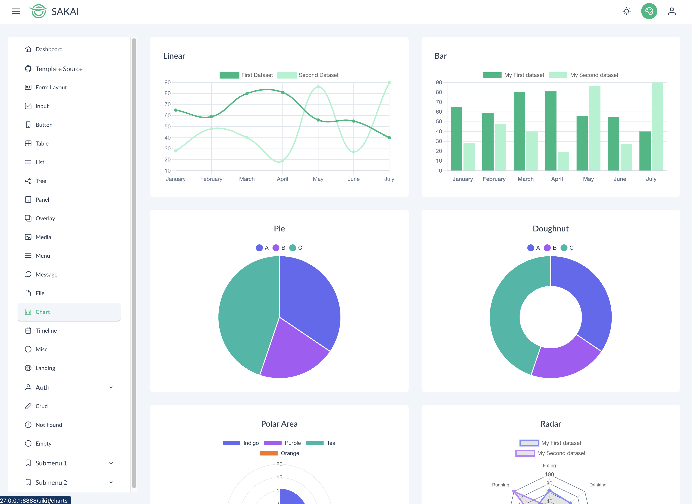

# About
This project is an initial template for building applications.
Built using using laravel 10, inertia, vue 3 and Sakai admin template.

# Screenshots
<p align="center">  
  &nbsp;
</p>

# Features
- Reusable Component base on Primevue
- SPA (Single Page Application)
- Role Based Access Control
- Responsive Design
- Modal Form
- Light/Dark Mode
- Toast Notification
- Datatable Serverside
# Requirements
- PHP 8.2
- Composer
- Node.js 18 or Above
- Mysql / Postgree SQL

# Installation
``` bash
git clone https://github.com/r14r/Starterkit_Laravel-Inertia-PrimeVue-Sakai.git starterkit
cd starterkit
composer install
npm install
cp .env.example .env
php artisan key:generate

SETTING UP DB CONNECTION IN .env
DB_CONNECTION=sqlite
# DB_HOST=127.0.0.1
# DB_PORT=3306
# DB_DATABASE=sakai
# DB_USERNAME=root
 #DB_PASSWORD=

php artisan migrate:fresh --seed

START THE SERVER
npm run dev
php artisan serve
```
## Login With
### Superadmin
``` bash
email : superadmin@superadmin.com
password : superadmin
```
### Admin
``` bash
email : admin@admin.com
password : admin
```
### Operator
``` bash
email : operator@operator.com
password : operator
```
# Note

If you find some bug please create the issue

# Credits

Thanks for riyanriky@gmail.com for the original version

